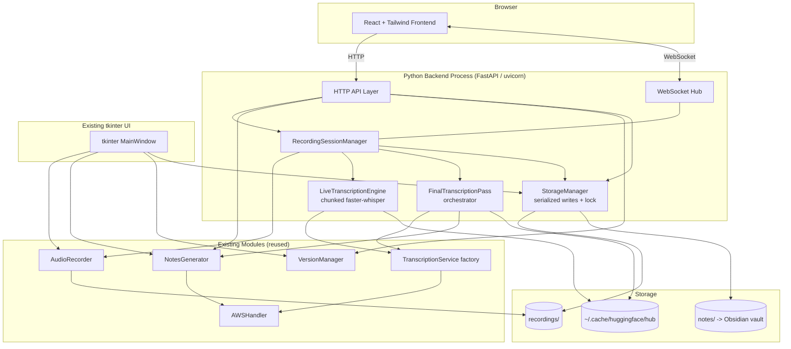
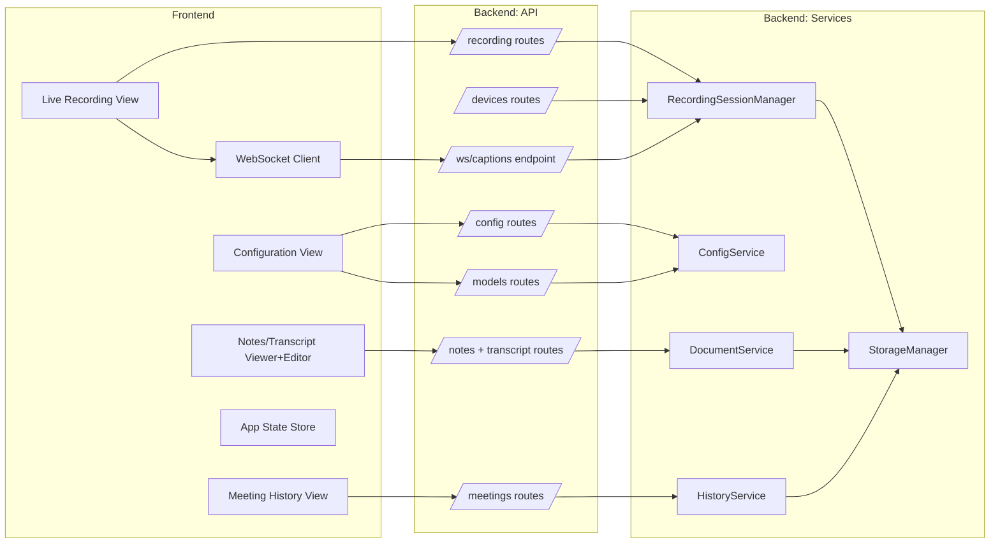
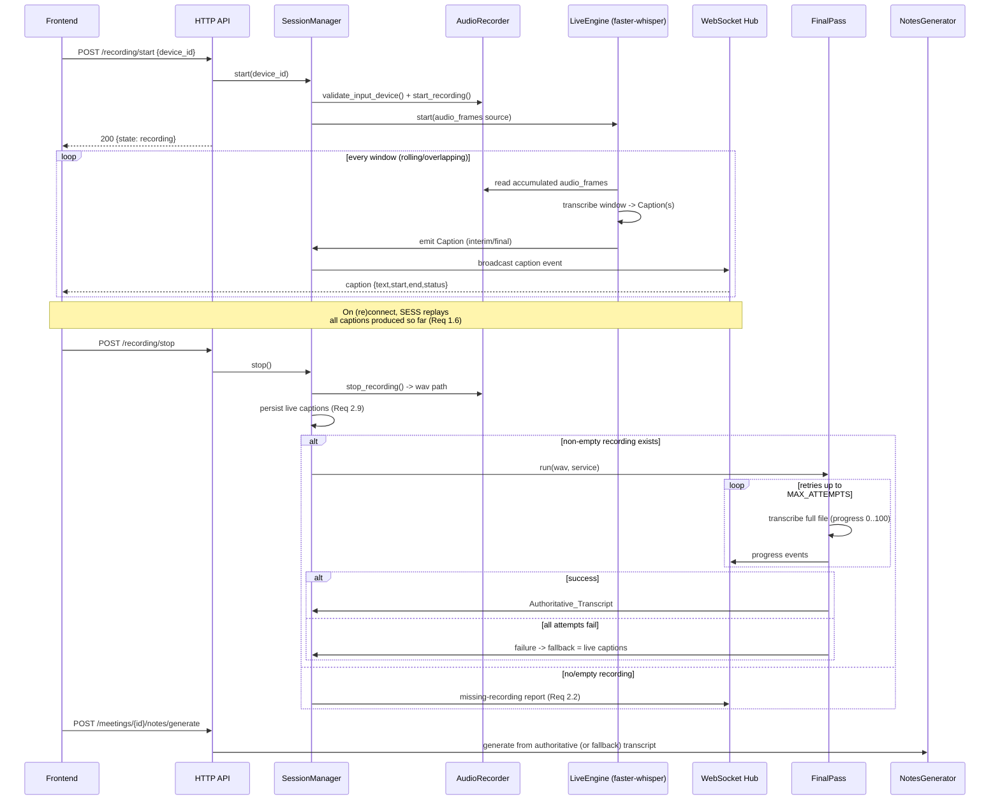
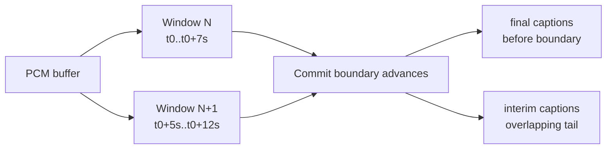
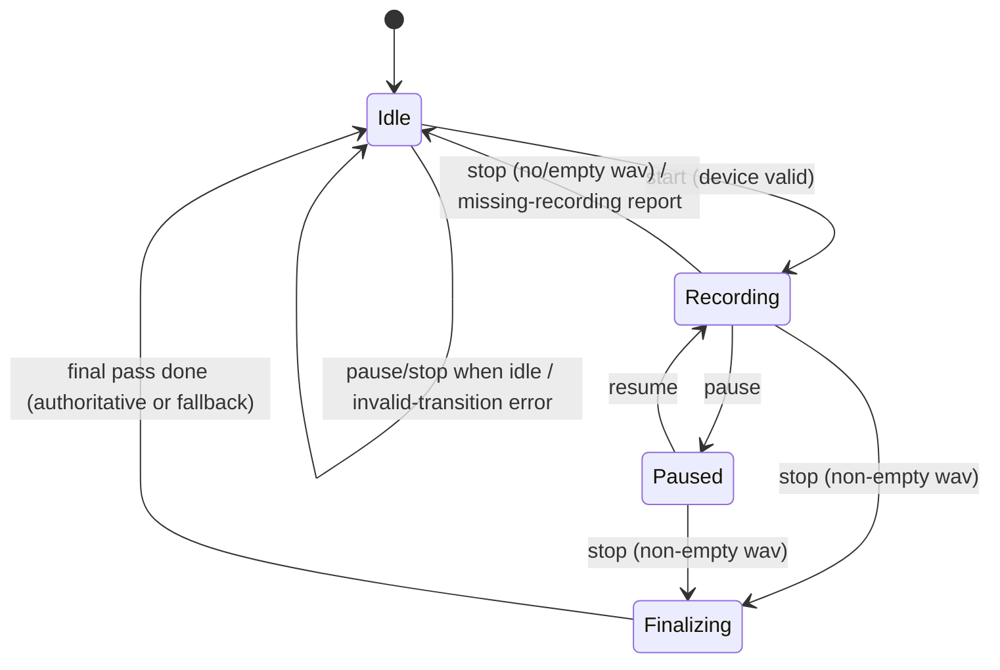
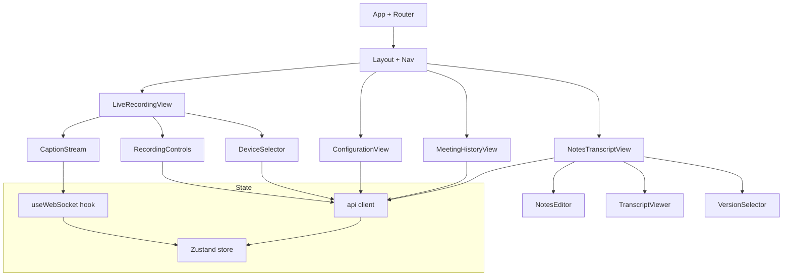

# Design Document

## Overview

This feature adds **live transcription** and a **modern web UI** to the Meeting Notes
Generator while preserving the existing tkinter desktop application during the transition.

Two capabilities are delivered together:

1. **Live transcription (the "A + C hybrid")** — while a meeting is recording, a
   `Live_Transcription_Engine` consumes audio in rolling, overlapping windows from the
   existing `AudioRecorder` and emits low-latency interim/final `Caption`s. When recording
   stops, a `Final_Transcription_Pass` runs the full recording through one of the existing
   batch `Transcription_Service`s to produce the `Authoritative_Transcript` used for notes
   generation. Live captions are the fallback transcript if the final pass fails.

2. **Web UI (backend + frontend split)** — a Python **FastAPI backend** wraps the existing
   logic (`AudioRecorder`, `TranscriptionService`, `NotesGenerator`, `VersionManager`,
   `AWSHandler`) behind HTTP + WebSocket APIs. A **React + Tailwind frontend** is the new
   primary interface. Live captions and status stream over a `WebSocket_Channel`.

The transcription layer stays **pluggable**: both live engines and batch services implement
small interfaces, so AWS Transcribe Streaming can be added later as a new live engine with
no frontend changes.

### Design Goals

- **Reuse, do not reimplement.** The backend orchestrates existing modules; it does not
  duplicate recording, transcription, notes, or versioning logic.
- **Pluggable transcription** for both the live path and the final pass.
- **Non-breaking coexistence** with the tkinter UI on shared storage, with serialized writes.
- **Storage hygiene** — WAVs never enter the notes folder (the git-backed Obsidian vault).
- **Resilience** — chunk failures, final-pass failures, device/silence problems, and model
  load failures are reported without losing already-produced data.

### Key Design Decisions

| Decision | Choice | Rationale |
|----------|--------|-----------|
| Live engine | Chunked local faster-whisper over rolling windows | Low latency, no network/cost, reuses cached models |
| Final pass | Existing batch `TranscriptionService` (`whisper`/`aws`/`mac`) | Authoritative accuracy over the full file |
| Transport | FastAPI HTTP for control/CRUD, WebSocket for captions/status | Request/response for state changes; push for streaming |
| Frontend | React + Tailwind SPA | Modern, matches requirement; decoupled from backend |
| State ownership | Recording/session state lives in the backend | Single source of truth shared by web + tkinter |
| Write safety | Single cross-process file lock + serialized writer | Prevents corruption when both UIs run (Req 9.3) |
| Future streaming | `LiveTranscriptionEngine` interface | AWS Transcribe Streaming plugs in here later |

### Out of Scope

- Implementing AWS Transcribe Streaming (only the plug-in seam is designed).
- Replacing or removing the tkinter UI (it remains operational and is deprecated gradually).
- Multi-user / authentication (the backend binds to localhost for a single local user).

## Architecture

### System Context



The web backend and the tkinter UI are **two processes that share the same storage**. Both
go through `StorageManager` for writes so a cross-process lock can serialize them.

### Layered Component View



### Live Transcription Data Flow



### Where AWS Transcribe Streaming Plugs In Later

AWS Transcribe Streaming would be a **new implementation of the `LiveTranscriptionEngine`
interface** registered under an id such as `aws-streaming`. It would:

- Receive the same PCM audio frames `RecordingSessionManager` already forwards to the live
  engine (instead of reading windows from `AudioRecorder.audio_frames`, the session can also
  push frames to a queue the engine consumes).
- Emit `Caption` objects in the identical interim/final shape, so the WebSocket contract and
  frontend are unchanged (Req 3.3).
- Be selected by id through the same `LiveEngineRegistry.get(id)` used for faster-whisper.

No frontend file and no recording/UI-layer code changes are required — only a new engine
class plus a registry entry. The batch `Transcription_Service` factory is untouched.

## Components and Interfaces

### Existing Components (wrapped, not modified)

| Component | File | How it is reused |
|-----------|------|------------------|
| `AudioRecorder` | `audio_capture.py` | Drives capture, device list, validation, silence/peak detection. The live engine reads `audio_frames`. |
| `TranscriptionService` | `transcription.py` | Factory for batch `whisper`/`aws`/`mac` used by the final pass. |
| `NotesGenerator` | `notes_generator.py` | `process_recording` / `generate_notes_from_transcript` for notes + versioned saves. |
| `VersionManager` | `version_manager.py` | Meeting metadata and notes versioning. |
| `AWSHandler` | `aws_services.py` | Bedrock notes, AWS Transcribe, S3, model listing. |

These are imported and orchestrated. No behavior is reimplemented (Req 4.5).

### New Backend Components

#### 1. `LiveTranscriptionEngine` (interface) and `WhisperLiveEngine` (implementation)

The pluggable seam for the live path.

```python
class LiveTranscriptionEngine(Protocol):
    id: str
    def start(self, sample_rate: int, channels: int) -> None: ...
    # Feed raw PCM frames as they are captured.
    def feed(self, pcm_chunk: bytes) -> None: ...
    # Pull any captions produced since the last poll (interim + finalized).
    def poll(self) -> list["Caption"]: ...
    def stop(self) -> list["Caption"]: ...  # flush final captions
```

`WhisperLiveEngine` implements this using **rolling, overlapping windows**:

- Maintains an in-memory PCM buffer of recently fed audio.
- Every `LIVE_WINDOW_SECONDS` (default 5s) it transcribes a window covering the last
  `LIVE_WINDOW_SECONDS + LIVE_OVERLAP_SECONDS` (default overlap 2s) of audio with
  faster-whisper.
- A **commit boundary** divides committed (final) audio time from the still-mutable tail.
  Segments that end before the commit boundary are emitted as `status=final`; segments in
  the overlapping tail are emitted as `status=interim` keyed by their `start` timestamp and
  may be revised by the next window (Req 1.2, 1.7).
- Window size/overlap and emit cadence are tuned so each caption is emitted within 10s of
  capture (Req 1.5).



`LiveEngineRegistry` maps engine id -> factory. faster-whisper is registered as `whisper`;
`aws-streaming` is the documented future entry.

#### 2. `RecordingSessionManager`

Owns all server-side recording state (single active session for a single local user).

```python
class RecordingSessionManager:
    def list_devices(self) -> list[Device]
    def select_device(self, device_id: int) -> None        # persisted via ConfigService
    def start(self, device_id: int | None) -> SessionState  # validates device (Req 5.5)
    def pause(self) -> SessionState
    def resume(self) -> SessionState
    def stop(self) -> StopResult                            # triggers final pass
    def current(self) -> SessionState
    def captions_snapshot(self) -> list[Caption]            # for WS replay (Req 1.6)
    def subscribe(self, ws) -> None                         # register a WS client
```

It enforces the recording state machine, runs a background poll loop that pulls captions
from the live engine and broadcasts them, persists captions, and kicks off the final pass on
stop.



#### 3. `FinalTranscriptionPass`

Runs the authoritative transcription after stop.

```python
class FinalTranscriptionPass:
    def run(self, wav_path: str, service_id: str,
            progress_cb: Callable[[int], None]) -> TranscriptResult
```

- Uses the existing `TranscriptionService.get_service(service_id, ...)` (or `AWSHandler` for
  `aws`) — same interface as the tkinter path (Req 3.1, 3.4).
- Reports progress 0–100 via `progress_cb`, which the session broadcasts (Req 2.6).
- Retries up to `FINAL_PASS_MAX_ATTEMPTS` (default 2) before declaring failure (Req 2.7).
- On success returns the authoritative transcript; on terminal failure the session selects
  the persisted live captions as fallback (Req 2.5, 2.8).

#### 4. `StorageManager`

The single choke point for writes to shared storage; provides coexistence safety.

```python
class StorageManager:
    def recordings_dir(self) -> str          # outside notes dir (Req 8.1, 8.2)
    def notes_dir(self) -> str
    def write_notes(self, meeting_id, content) -> str   # serialized
    def write_transcript(self, meeting_id, json_obj, text) -> tuple[str, str]
    def write_captions(self, meeting_id, captions) -> str
    def read_text(self, path) -> str
    @contextmanager
    def write_lock(self): ...                # cross-process file lock
```

- All note/transcript/caption writes acquire a **cross-process advisory lock** (a lockfile
  under the metadata dir using `fcntl.flock`) so concurrent tkinter + web writes are
  serialized (Req 9.3).
- Enforces the storage-location invariant: WAVs only to `recordings_dir`, never to
  `notes_dir` (Req 8.1–8.3). A guard rejects any attempt to write a `.wav` path under the
  notes dir.

#### 5. `ConfigService`

Wraps `config.py` defaults + `user_settings.json` for the live/applied configuration.

```python
class ConfigService:
    def get(self) -> AppConfig
    def update(self, patch: dict) -> AppConfig   # validates against allowed options
    def available_models(self) -> list[Model]    # via AWSHandler.list_available_models
```

- Validates `transcription_service ∈ {whisper, aws, mac}`, `whisper_model_size ∈
  {tiny, base, small, medium, large}`, and AI model ∈ backend-provided list (Req 6.1, 6.3,
  6.7).
- Rejects out-of-range values and retains the last-applied config (Req 6.7, 6.9).
- Persists to `user_settings.json` so config survives restarts (Req 6.9).
- An in-progress operation captures a config snapshot at start so later changes don't affect
  it (Req 6.8).

#### 6. `HistoryService` and `DocumentService`

- `HistoryService` wraps `VersionManager.get_all_meetings_with_metadata()` and
  `NotesGenerator.get_notes_list()` to return the descending-ordered meeting list (Req 7.1).
- `DocumentService` reads/edits/saves notes and transcripts and creates new versions via
  `VersionManager` + `NotesGenerator` versioned save path (Req 7.4–7.7).

#### 7. `WebSocketHub`

Tracks connected clients, broadcasts caption/status/progress/error events, and on connect
replays the caption snapshot before live events (Req 1.6).

### Frontend Components



- **State management:** a lightweight store (Zustand) holds `recordingState`, `captions`
  (an ordered, de-duplicated map keyed by `start` timestamp), `config`, `devices`,
  `meetings`, and the currently open document/version.
- **Caption handling:** the `CaptionStream` renders captions ordered by ascending `start`.
  Interim captions with the same `start` replace prior interim text rather than appending
  (Req 1.4, 1.7). Final captions supersede interim at the same `start`.
- **WebSocket integration:** `useWebSocket` connects to `/ws/captions`, applies replayed
  captions first, then live events; on chunk-error events it shows an inline error while
  keeping displayed captions (Req 1.9). It auto-reconnects and relies on backend replay to
  resync (Req 1.6).
- **Controls enable/disable** strictly follow recording state (Req 5.3, 5.4).

### Backend API Surface

#### HTTP Endpoints

| Method | Path | Purpose | Requirements |
|--------|------|---------|--------------|
| GET | `/api/devices` | List available input devices (empty list ok) | 4.2, 5.1 |
| POST | `/api/devices/select` | Persist selected input device | 5.2 |
| POST | `/api/recording/start` | Start recording `{device_id?}` | 4.1, 5.5, 4.8 |
| POST | `/api/recording/pause` | Pause active recording | 4.1, 4.7 |
| POST | `/api/recording/resume` | Resume paused recording | 4.1, 5.7 |
| POST | `/api/recording/stop` | Stop + trigger final pass | 4.1, 2.1, 2.2 |
| GET | `/api/recording/state` | Current session state | 5.3, 5.4 |
| GET | `/api/meetings` | Meeting history (desc by start) | 4.3, 7.1 |
| GET | `/api/meetings/{id}` | Meeting detail + versions | 7.2 |
| GET | `/api/meetings/{id}/notes?version=` | Read notes (optional version) | 7.2, 7.7 |
| PUT | `/api/meetings/{id}/notes` | Save edited notes (new version) | 7.4, 7.6 |
| POST | `/api/meetings/{id}/notes/generate` | Regenerate notes (no persist) | 7.8, 7.9 |
| GET | `/api/meetings/{id}/transcript?version=` | Read transcript | 7.2 |
| PUT | `/api/meetings/{id}/transcript` | Save edited transcript | 7.4 |
| GET | `/api/config` | Read applied config | 6.2 |
| PUT | `/api/config` | Update config (validated) | 6.6, 6.7 |
| GET | `/api/models` | Available AI models | 6.5 |

Error responses use a consistent envelope `{error: {code, message, resource?}}`.
Not-found returns 404 leaving data unchanged (Req 4.6); invalid state transitions return 409
leaving state unchanged (Req 4.7); unavailable device returns 422 without starting (Req 4.8).

#### WebSocket Channel — `/ws/captions`

Server → client event envelope: `{type, seq, payload}` where `type ∈`:

| type | payload | Requirements |
|------|---------|--------------|
| `caption` | `{text, start, end, status}` | 1.3, 1.7 |
| `status` | `{state, duration}` | 4.4 |
| `final_progress` | `{percent}` (0–100) | 2.6 |
| `chunk_error` | `{chunk_id, message}` | 1.8, 1.9 |
| `final_result` | `{outcome: authoritative\|fallback\|failed}` | 2.3, 2.5, 2.8 |
| `missing_recording` | `{meeting_id}` | 2.2 |
| `silent_warning` | `{meeting_id, peak_amplitude}` | 5.8 |
| `device_error` | `{message}` | 5.6 |

On connect/reconnect the hub first sends the buffered `caption` snapshot in ascending
`start` order, then resumes live events (Req 1.6).

## Data Models

### Caption

```python
@dataclass(frozen=True)
class Caption:
    start: float          # seconds from recording start
    end: float            # seconds from recording start, end >= start
    text: str
    status: Literal["interim", "final"]
```

Identity for de-duplication/replacement is the `start` timestamp (Req 1.7). Captions are
ordered by ascending `start` (Req 1.4).

### SessionState

```python
@dataclass
class SessionState:
    state: Literal["idle", "recording", "paused", "finalizing"]
    meeting_id: str | None        # YYYYMMDD_HHMMSS, assigned at start
    device_id: int | None
    duration_seconds: float
    started_at: str | None        # ISO-8601
    final_progress: int | None    # 0..100 while finalizing
```

### StopResult

```python
@dataclass
class StopResult:
    meeting_id: str | None
    recording_path: str | None     # in recordings/ only
    has_recording: bool            # non-empty file present (Req 2.1/2.2)
    was_silent: bool               # Req 5.8
    peak_amplitude: int
```

### TranscriptResult

The shared, implementation-independent transcript structure (the existing AWS-Transcribe-
compatible dict): `{"results": {"transcripts": [{"transcript": str}], "items": [...],
"speaker_labels": {...}}}`. Both batch services and the live engine's persisted output
conform to this so notes generation is source-agnostic (Req 3.1, 2.4, 2.5).

### MeetingSummary / MeetingDetail (history + detail)

```python
@dataclass
class MeetingSummary:
    meeting_id: str
    display_date: str
    title: str
    latest_version: int

@dataclass
class NotesVersion:
    version_num: int
    name: str
    creation_time: str            # ISO-8601
    is_default: bool
```

These map directly onto `VersionManager` metadata; the API does not introduce a parallel
versioning scheme.

### AppConfig

```python
@dataclass
class AppConfig:
    transcription_service: Literal["whisper", "aws", "mac"]
    whisper_model_size: Literal["tiny", "base", "small", "medium", "large"]
    ai_model_id: str
    input_device_id: int | None
    live_window_seconds: float = 5.0
    live_overlap_seconds: float = 2.0
    final_pass_max_attempts: int = 2
    silence_threshold: int = 30
    silence_fraction_threshold: float = 0.95   # Req 5.8
```

### Persistence Layout & Storage Hygiene

| Artifact | Location | Notes |
|----------|----------|-------|
| Recording WAV | `recordings/meeting_{id}.wav` | Outside notes dir; never copied to notes (Req 8.1, 8.2) |
| Transcript JSON/TXT | `notes/transcript_{id}.json` / `.txt` | In notes dir (Req 8.3) |
| Live captions | `notes/captions_{id}.json` | Persisted on stop for fallback (Req 2.9) |
| Notes | `notes/meeting_notes_{id}[_v{n}].md` | Versioned via existing scheme (Req 7.6) |
| Metadata | `notes/metadata/meeting_{id}_metadata.json` | `VersionManager` |
| Write lock | `notes/metadata/.write.lock` | Cross-process serialization (Req 9.3) |
| faster-whisper models | `~/.cache/huggingface/hub` | Global cache, download on miss (Req 8.4, 8.5) |

A storage-hygiene guard in `StorageManager` rejects any write whose target is a `.wav` under
`notes_dir`, making the invariant enforceable and testable (Req 8.2).

## Correctness Properties

*A property is a characteristic or behavior that should hold true across all valid
executions of a system — essentially, a formal statement about what the system should do.
Properties serve as the bridge between human-readable specifications and machine-verifiable
correctness guarantees.*

The following properties are derived from the acceptance criteria via the prework analysis.
Redundant criteria were consolidated: state-machine criteria, control-enablement criteria,
storage-location criteria, transcript-selection branches, and ordering criteria were each
merged into single comprehensive properties. Criteria classified as INTEGRATION, EXAMPLE,
SMOKE, or EDGE_CASE are covered by the Testing Strategy rather than as properties.

### Property 1: Caption store ordering, uniqueness, and latest-wins

*For any* sequence of caption and chunk-error events applied to the caption store, the
resulting displayed list is sorted by ascending `start`, contains no two captions with the
same `start` (a same-`start` arrival replaces the prior one, and a `final` supersedes an
`interim` at that `start`), and applying a chunk-error event never removes any already-
displayed caption.

**Validates: Requirements 1.4, 1.7, 1.9**

### Property 2: Caption replay completeness on (re)connect

*For any* set of captions already produced for a recording and *any* point at which a client
connects or reconnects, the stream the client receives is the ordered snapshot of all
captions produced before connect (ascending `start`) followed by subsequently produced
captions, such that every produced caption is delivered exactly once per distinct `start`.

**Validates: Requirements 1.6**

### Property 3: Chunk-failure resilience

*For any* sequence of audio chunks with an arbitrary subset designated to fail, every
non-failing chunk still yields its caption(s), all captions produced before a failure are
retained, an error notification is emitted for each failing chunk, and processing continues
to subsequent chunks.

**Validates: Requirements 1.8**

### Property 4: Final-pass start decision

*For any* stop result, the system starts a `Final_Transcription_Pass` if and only if a
non-empty recording file exists; when it does not exist, no pass is started and a
missing-recording condition is reported.

**Validates: Requirements 2.1, 2.2**

### Property 5: Authoritative-preferred transcript selection

*For any* combination of (authoritative transcript present or absent, persisted live captions
present or absent), the transcript chosen for notes generation is the authoritative
transcript when present, otherwise the persisted live captions; the selection returns a
transcript whenever at least one source exists.

**Validates: Requirements 2.4, 2.5**

### Property 6: Final-pass progress bounds and monotonicity

*For any* final-pass run, every reported progress value lies within the inclusive range
0–100 and the sequence of reported values is non-decreasing, reaching 100 on success.

**Validates: Requirements 2.6**

### Property 7: Final-pass retry count and retention on failure

*For any* configured maximum attempts N and a transcriber that fails K times before
succeeding, the pass performs `min(K+1, N)` attempts, declares failure only after exactly N
failed attempts, and on terminal failure the recording file and persisted live captions both
still exist afterward and a failure is reported.

**Validates: Requirements 2.7, 2.8**

### Property 8: Caption persistence round-trip

*For any* list of captions, persisting them on stop and then reading them back yields an
equal list with the same ordering.

**Validates: Requirements 2.9**

### Property 9: Transcript structure conformance across services

*For any* registered transcription service identifier, the transcript structure it returns
(or the normalized form for the live engine) conforms to the shared schema — it contains
`results.transcripts[0].transcript` as a string — independent of the implementation.

**Validates: Requirements 3.1**

### Property 10: Unknown-service rejection preserves active service

*For any* identifier that is not in the registered set of transcription services, requesting
it is rejected with an error and the currently active transcription service is left
unchanged.

**Validates: Requirements 3.5**

### Property 11: Recording state-machine transition validity

*For any* current recording state and *any* requested transition (start, pause, resume,
stop), the system applies the transition only when it is valid for that state; for an invalid
transition it returns an error and leaves the recording state unchanged.

**Validates: Requirements 4.1, 4.7**

### Property 12: Not-found requests leave stored data unchanged

*For any* request referencing a meeting or resource identifier that does not exist, the
backend returns a not-found error identifying the missing resource and the set of stored
meetings, notes, and transcripts is unchanged.

**Validates: Requirements 4.6**

### Property 13: Start device validation and selection retention

*For any* requested start, recording begins only if the selected input device is present in
the current device list and passes accessibility validation; if either check fails, recording
does not start, the state remains idle, the failure reason is reported, and the previous
device selection is retained.

**Validates: Requirements 4.8, 5.5, 5.6**

### Property 14: Device selection persistence

*For any* valid input device identifier, selecting it and then reading the configuration
returns that identifier as the active device until it is changed.

**Validates: Requirements 5.2**

### Property 15: Control enablement is a function of state

*For any* recording state, the enabled controls are determined solely by that state: start is
enabled only when idle; pause and stop are enabled only while recording or paused. *For any*
selected transcription service, the whisper-model-size control is enabled if and only if the
service is `whisper`.

**Validates: Requirements 5.3, 5.4, 6.4**

### Property 16: Pause/resume preserves and appends audio

*For any* interleaving of record, pause, and resume actions over a stream of audio frames,
the saved recording equals the in-order concatenation of exactly the frames captured during
non-paused intervals, with no pre-pause audio dropped and no paused audio included.

**Validates: Requirements 5.7**

### Property 17: Silence classification threshold

*For any* captured sample buffer, the silent-recording warning is raised if and only if the
fraction of samples whose absolute amplitude is at or below the silence threshold is greater
than or equal to 0.95 of the recording's duration.

**Validates: Requirements 5.8**

### Property 18: Configuration validation and round-trip persistence

*For any* configuration update, if every value is within its allowed option set the update is
applied, persisted, and returned on the next read (including after a restart/reload); if any
value is outside its allowed set the update is rejected and the active configuration remains
equal to the previously applied configuration.

**Validates: Requirements 6.6, 6.7, 6.9**

### Property 19: In-flight operations use a config snapshot

*For any* transcription or notes-generation operation started with configuration C, any
configuration update applied after the operation starts leaves that operation's effective
configuration equal to C.

**Validates: Requirements 6.8**

### Property 20: Descending timestamp ordering of history and versions

*For any* set of meetings, the meeting history is ordered by start timestamp descending; and
*for any* meeting, its saved notes versions are listed by creation timestamp descending.

**Validates: Requirements 7.1, 7.7**

### Property 21: Version monotonicity, retention, and read-back

*For any* sequence of note saves for a meeting that already has at least one version, each
save creates a new version with a strictly greater version number, all previously saved
version files remain byte-for-byte unchanged, and reading back any saved version returns the
exact content that was written for it.

**Validates: Requirements 7.4, 7.6**

### Property 22: Regeneration does not persist

*For any* meeting, a notes-regeneration request leaves the set and count of persisted notes
versions unchanged until the user explicitly saves.

**Validates: Requirements 7.8**

### Property 23: Storage-location invariant

*For any* recording, notes, and transcript produced for any meeting, the recording WAV
resides under the recordings folder and never under the notes folder, and the generated notes
and transcripts reside under the notes folder; any attempt to write a `.wav` path under the
notes folder is rejected.

**Validates: Requirements 8.1, 8.2, 8.3**

### Property 24: Model-load failure writes nothing to the notes folder

*For any* transcription attempt in which the required faster-whisper model fails to load, the
transcription is aborted, an error is reported, and no new notes or transcript files appear
under the notes folder.

**Validates: Requirements 8.6**

### Property 25: Concurrent writes are atomic

*For any* set of concurrent write operations issued to the same storage target through the
`StorageManager` write lock, the resulting file content equals exactly one writer's complete
payload — no write is partially applied or interleaved with another, and no previously saved
version file is left partially written.

**Validates: Requirements 7.5, 9.3**

## Error Handling

| Failure | Detection | Handling | Requirements |
|---------|-----------|----------|--------------|
| Invalid/unavailable input device on start | `AudioRecorder.validate_input_device()` + device-list membership | Reject start (422), keep state idle, retain prior selection, emit `device_error` | 4.8, 5.5, 5.6 |
| Live chunk transcription failure | Exception around per-window transcribe | Emit `chunk_error{chunk_id}`, retain prior captions, continue next window | 1.8, 1.9 |
| Silent recording | `was_silent` / `peak_amplitude` after stop | Emit `silent_warning` (non-fatal) | 5.8 |
| No/empty recording on stop | File existence + size check | Skip final pass, emit `missing_recording` | 2.2 |
| Final pass failure | Exception per attempt | Retry up to `final_pass_max_attempts`; then fall back to live captions or emit `final_result{failed}`; retain wav + captions | 2.5, 2.7, 2.8 |
| Unknown transcription service id | Registry lookup miss | Error response; active service unchanged | 3.5 |
| Service dependency unavailable | Import/init failure | Report failure; return no partial transcript | 3.6 |
| Model cache miss | Cache path absent | Download model and proceed | 8.5 |
| Model load failure | Exception in loader | Abort transcription; no partial writes to notes dir; error reported | 8.6 |
| Unknown meeting/resource | Lookup miss | 404 with resource id; data unchanged | 4.6 |
| Invalid state transition | State-machine guard | 409 error; state unchanged | 4.7 |
| Invalid config value | Option-set validation | Reject; retain last-applied; frontend error | 6.7 |
| Notes save failure | Exception during write (under lock) | Leave prior version unchanged; frontend error | 7.5 |
| Notes regeneration failure | `NotesGenerator` returns None / raises | Frontend error; retain displayed notes | 7.9 |
| Backend down / unreachable | WS connect + HTTP failures | tkinter remains operable; frontend shows unavailable | 9.5 |
| Concurrent write contention | Cross-process lock | Serialize; atomic temp-file rename | 9.3 |

**Cross-cutting handling principles:**

- **Atomic writes:** notes/transcript/caption writes go to a temp file then `os.replace`
  into place under the write lock, guaranteeing readers never see partial content and
  failures leave prior content intact (Props 21, 25).
- **No data loss on failure:** the recording WAV and persisted captions are never deleted as
  part of error handling; fallback always prefers retaining data (Props 5, 7).
- **Error envelope:** HTTP errors use `{error:{code,message,resource?}}`; WS errors are typed
  events (`chunk_error`, `device_error`, `final_result`, `missing_recording`).

## Testing Strategy

A **dual approach** is used: property-based tests for universal invariants and example/
integration tests for specific behaviors, transport wiring, timing, and UI rendering.

### Property-Based Testing

PBT **is appropriate** for this feature's pure logic: the caption store/merge, replay,
transcript selection, retry counting, silence classification, config validation, version
monotonicity, ordering, and storage-location guards are all input-driven functions with clear
invariants.

- **Library:** `hypothesis` for Python backend logic; `fast-check` for the frontend caption-
  store reducer (TypeScript).
- **Iterations:** each property test runs a minimum of **100 iterations**.
- **Mocks for cost/isolation:** the live engine and final pass are tested against a
  **fake transcriber** that returns deterministic segments (and can be told to fail K times),
  so properties about chunking, retries, progress, and selection run fast without loading
  real models or calling AWS. Real faster-whisper / AWS runs are reserved for integration
  tests.
- **Tagging:** each property test references its design property using the format:
  **Feature: live-transcription-web-ui, Property {number}: {property_text}**
- **Coverage:** each of Properties 1–25 is implemented by a single property-based test.
  Generators include: random caption-event sequences (varying `start`/`end`/`status`),
  random failing-chunk subsets, random sample buffers (incl. all-silent and all-loud edges),
  random config patches (valid and out-of-range), random pause/resume interleavings, random
  meeting/version save sequences, and random non-existent identifiers.

### Unit / Example Tests

- Device list empty-state and populated cases (4.2, 5.1).
- Factory `get_service('whisper'|'aws'|'mac')` returns conforming instances (3.2, 3.4).
- Dependency-unavailable init failure returns no transcript (3.6).
- Regeneration failure path retains displayed notes (7.9).
- Notes/transcript read errors keep history list intact (7.3).
- Read-after-write consistency between web and tkinter paths (9.2, 9.4).
- Frontend component tests: option sets for service/model-size/AI model (6.1, 6.3, 6.5),
  config view pre-selection (6.2), control enable/disable rendering.

### Integration Tests

- End-to-end live path: feed a short fixed WAV through `WhisperLiveEngine`, assert captions
  produced and streamed to a connected WS test client (1.1, 1.3, 4.4).
- Final pass success producing a stored authoritative transcript (2.3).
- Model-cache-miss download fallback with a mocked downloader (8.5).
- Latency budget check: caption emit within 10s on a reference window (1.5) — measured, not
  asserted as a hard property.

### Smoke Tests

- tkinter UI launches and completes startup unchanged (9.1).
- faster-whisper loader is pointed at `~/.cache/huggingface/hub` (8.4).
- A newly registered live/batch engine id is selectable on the backend with no frontend
  change (3.3).

### Coexistence / Concurrency Tests

- Concurrent writers (simulated tkinter + web) hammering the same notes file through the
  write lock; assert the final file equals one complete payload and no version file is
  partial (Property 25, Req 9.3).
- Backend-down scenario: terminate the backend and verify tkinter still reads/writes and the
  frontend shows the unavailable indicator (9.5).
